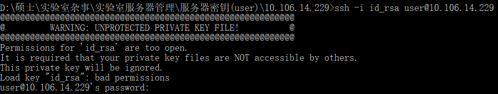

## 测试密钥
请大家使用本地的shell命令行进行测试: windows用户按`win + R`弹出一个窗口，然后输入cmd进入终端。mac用户直接进入终端即可

### 1. 进入终端

### 2. 使用密钥登录
shell命令行登录:
~~~shell
ssh -i RootToid_rsa user@10.106.14.226 # RootToid_rsa是id_rsa(私钥)在本地的路径
~~~

如果不用输入密码即可直接登录进账户，那么测试通过。

如果出现以下问题：

则需要更改密钥在本地的拥有权限。点击[修改权限](../修改权限/修改权限.md)跳转
